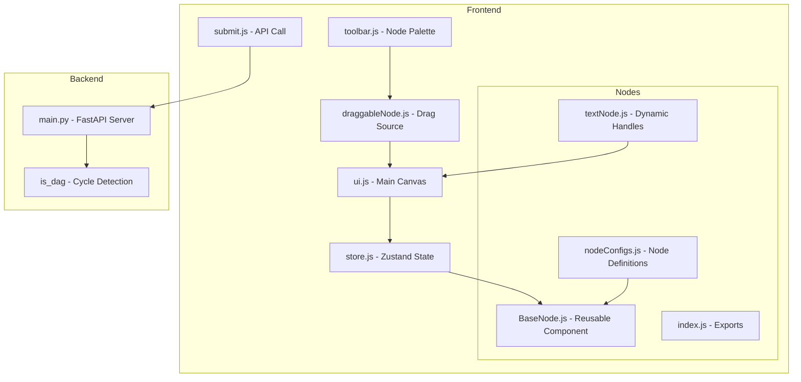
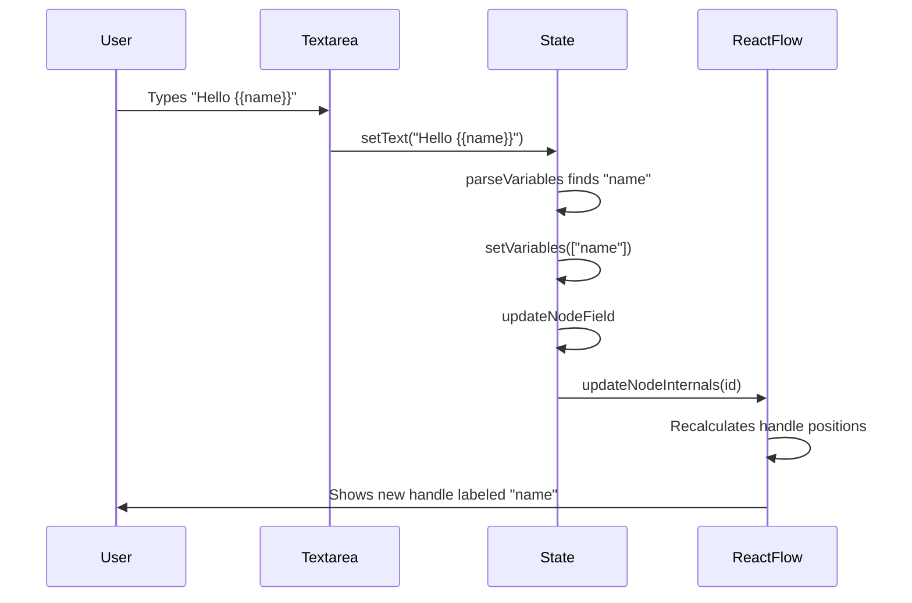
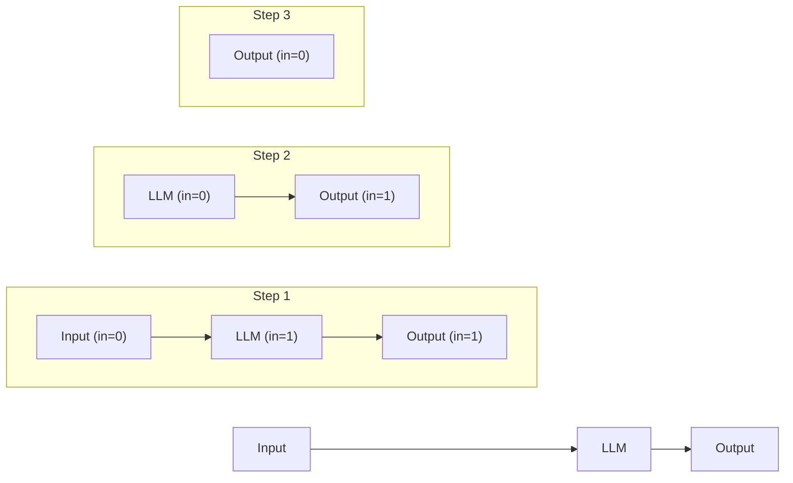
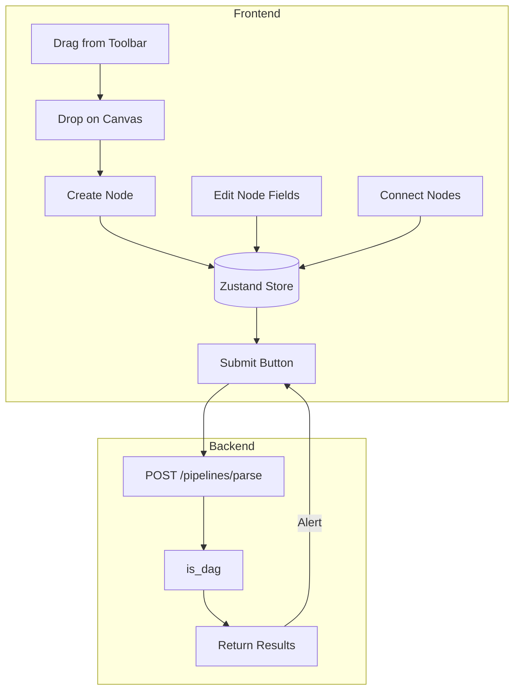

# VectorShift Frontend Technical Assessment - Complete Documentation

## Overview

This document explains the entire codebase line by line. The project is a visual pipeline builder where users drag nodes onto a canvas, connect them with edges, and submit the pipeline for validation.

---

## Architecture



---

## File-by-File Explanation

### 1. store.js - Global State

```javascript
import { create } from 'zustand';

export const useStore = create((set, get) => ({
  nodes: [],        // Array of all nodes on canvas
  edges: [],        // Array of all connections
  
  // Called when nodes change (drag, add, remove)
  onNodesChange: (changes) => {
    set({ nodes: applyNodeChanges(changes, get().nodes) });
  },
  
  // Called when edges change (connect, disconnect)
  onEdgesChange: (changes) => {
    set({ edges: applyEdgeChanges(changes, get().edges) });
  },
  
  // Called when user creates a connection
  onConnect: (connection) => {
    set({ edges: addEdge(connection, get().edges) });
  },
  
  // Update a specific field in a node's data
  updateNodeField: (nodeId, fieldName, fieldValue) => {
    set({
      nodes: get().nodes.map((node) => {
        if (node.id === nodeId) {
          return {
            ...node,
            data: { ...node.data, [fieldName]: fieldValue },
          };
        }
        return node;
      }),
    });
  },
}));
```

**Why Zustand?**
- Simple: No boilerplate like Redux
- Direct updates: `set({ nodes: [...] })` just works
- Access anywhere: `useStore((state) => state.nodes)`

---

### 2. nodeConfigs.js - Node Definitions

Each node type has a config object with:
- `type`: Unique identifier (matches ReactFlow nodeTypes)
- `title`: Display name in header
- `handles`: Array of connection points
- `fields`: Array of form inputs

```javascript
// Example: LLM Node
export const llmNodeConfig = {
  type: 'llm',
  title: 'LLM',
  handles: [
    { id: 'system', type: 'target', position: 'Left' },   // Input: system prompt
    { id: 'prompt', type: 'target', position: 'Left' },   // Input: user prompt
    { id: 'response', type: 'source', position: 'Right' } // Output: response
  ],
  fields: []  // No form fields, just handles
};
```

**Handle Types:**
- `target`: Receives connections (input)
- `source`: Sends connections (output)

---

### 3. BaseNode.js - Reusable Node Component

```javascript
import { Handle, Position } from 'reactflow';
import { useStore } from '../store';

// Convert string positions to ReactFlow constants
const positionMap = {
  Left: Position.Left,
  Right: Position.Right,
};

export const BaseNode = ({ id, data, config }) => {
  // Get the store function to update fields
  const updateNodeField = useStore((state) => state.updateNodeField);

  // Called when any input changes
  const handleChange = (fieldName, value) => {
    updateNodeField(id, fieldName, value);
  };

  return (
    <div className={`base-node ${data.nodeType}`}>
      {/* Header with title */}
      <div className="node-header">
        <span>{config.title}</span>
      </div>
      
      {/* Body with form fields */}
      <div className="node-body">
        {config.fields.map((field) => {
          // Get current value from data, or use default
          const value = data[field.name] !== undefined 
            ? data[field.name] 
            : field.defaultValue;

          if (field.type === 'select') {
            return (
              <label key={field.name}>
                <span>{field.label}:</span>
                <select
                  value={value}
                  onChange={(e) => handleChange(field.name, e.target.value)}
                >
                  {field.options.map((opt) => (
                    <option key={opt} value={opt}>{opt}</option>
                  ))}
                </select>
              </label>
            );
          }

          // Default: text input
          return (
            <label key={field.name}>
              <span>{field.label}:</span>
              <input
                type="text"
                value={value}
                onChange={(e) => handleChange(field.name, e.target.value)}
              />
            </label>
          );
        })}
      </div>

      {/* Render handles with proper positioning */}
      {config.handles.map((handle) => {
        // Calculate vertical position for multiple handles on same side
        const samePositionHandles = config.handles.filter(
          h => h.position === handle.position
        );
        const indexOnSide = samePositionHandles.indexOf(handle);
        const total = samePositionHandles.length;
        
        // Spread handles evenly: 1 handle = 50%, 2 handles = 33%, 66%, etc.
        const offset = total > 1 
          ? ((indexOnSide + 1) / (total + 1)) * 100 
          : 50;

        return (
          <Handle
            key={handle.id}
            type={handle.type}
            position={positionMap[handle.position]}
            id={`${id}-${handle.id}`}  // Unique ID: nodeId-handleId
            style={{ top: `${offset}%` }}
          />
        );
      })}
    </div>
  );
};
```

**Key Points:**
1. `data.nodeType` adds a class for CSS styling (different header colors)
2. Each handle gets a unique ID: `nodeId-handleId` 
3. Multiple handles on same side are spread evenly using percentage

---

### 4. textNode.js - Dynamic Handles

The text node parses `{{variables}}` and creates input handles for each:

```javascript
import { useState, useEffect, useRef } from 'react';
import { Handle, Position, useUpdateNodeInternals } from 'reactflow';
import { useStore } from '../store';

// Regex to find {{variableName}}
// Matches: {{ input }}, {{name}}, {{user_data}}
// Valid: starts with letter or underscore, then letters/numbers/underscores
function parseVariables(text) {
  if (!text) return [];
  
  const regex = /\{\{\s*([a-zA-Z_$][a-zA-Z0-9_$]*)\s*\}\}/g;
  const found = [];
  let match;
  
  while ((match = regex.exec(text)) !== null) {
    // match[1] is the captured group (variable name)
    if (!found.includes(match[1])) {
      found.push(match[1]);
    }
  }
  
  return found;
}

export const TextNode = ({ id, data }) => {
  const updateNodeField = useStore((state) => state.updateNodeField);
  
  // This hook tells ReactFlow to recalculate handle positions
  const updateNodeInternals = useUpdateNodeInternals();
  
  const textareaRef = useRef(null);
  
  // Local state for text input
  const [text, setText] = useState(data?.text || '{{input}}');
  
  // Parsed variables from text
  const [variables, setVariables] = useState(() => 
    parseVariables(data?.text || '{{input}}')
  );

  // When text changes, update everything
  useEffect(() => {
    const newVars = parseVariables(text);
    setVariables(newVars);
    updateNodeField(id, 'text', text);
    updateNodeInternals(id); // IMPORTANT: tells ReactFlow handles changed
  }, [text, id, updateNodeField, updateNodeInternals]);

  // Auto-resize textarea to fit content
  useEffect(() => {
    const el = textareaRef.current;
    if (el) {
      el.style.height = 'auto';
      el.style.height = Math.min(el.scrollHeight, 150) + 'px';
    }
  }, [text]);

  return (
    <div className="base-node text">
      <div className="node-header">
        <span>Text</span>
      </div>
      <div className="node-body">
        <label>
          <span>Text:</span>
          <textarea
            ref={textareaRef}
            value={text}
            onChange={(e) => setText(e.target.value)}
            placeholder="Type text with {{variables}}"
          />
        </label>
        {/* Show detected variables */}
        {variables.length > 0 && (
          <div className="variables-list">
            Variables: {variables.join(', ')}
          </div>
        )}
      </div>

      {/* Create a handle for each variable */}
      {variables.map((varName, i) => {
        const offset = ((i + 1) / (variables.length + 1)) * 100;
        return (
          <Handle
            key={varName}
            type="target"
            position={Position.Left}
            id={`${id}-${varName}`}
            style={{ top: `${offset}%` }}
          />
        );
      })}

      {/* Fixed output handle */}
      <Handle
        type="source"
        position={Position.Right}
        id={`${id}-output`}
      />
    </div>
  );
}
```

**Flow:**


---

### 5. nodes/index.js - Central Exports

```javascript
// Import configs
import { nodeConfigs } from './nodeConfigs';

// Import components
import { BaseNode } from './BaseNode';
import { TextNode } from './textNode';

// Create wrapper components for BaseNode types
const InputNode = (props) => (
  <BaseNode {...props} config={nodeConfigs.customInput} />
);

const OutputNode = (props) => (
  <BaseNode {...props} config={nodeConfigs.customOutput} />
);

// ... similar for all other nodes

// nodeTypes maps type strings to components
// ReactFlow uses this to render the right component for each node
export const nodeTypes = {
  customInput: InputNode,
  customOutput: OutputNode,
  llm: LLMNode,
  text: TextNode,  // TextNode is special, not wrapped in BaseNode
  note: NoteNode,
  math: MathNode,
  timer: TimerNode,
  logger: LoggerNode,
  join: JoinNode,
};
```

---

### 6. draggableNode.js - Drag Source

```javascript
export const DraggableNode = ({ type, label }) => {
  const onDragStart = (event) => {
    // Store the node type in the drag data
    event.dataTransfer.setData(
      'application/reactflow', 
      JSON.stringify({ nodeType: type })
    );
    event.dataTransfer.effectAllowed = 'move';
  };

  return (
    <div
      className="draggable-item"
      draggable
      onDragStart={onDragStart}
    >
      {label}
    </div>
  );
};
```

**What happens on drag:**
1. User drags item from toolbar
2. `onDragStart` stores nodeType in dataTransfer
3. User drops on canvas
4. `ui.js` reads dataTransfer and creates node

---

### 7. toolbar.js - Node Palette

```javascript
import { DraggableNode } from './draggableNode';

export const PipelineToolbar = () => {
  return (
    <div className="toolbar">
      <DraggableNode type='customInput' label='Input' />
      <DraggableNode type='customOutput' label='Output' />
      <DraggableNode type='llm' label='LLM' />
      <DraggableNode type='text' label='Text' />
      <DraggableNode type='note' label='Note' />
      <DraggableNode type='math' label='Math' />
      <DraggableNode type='timer' label='Timer' />
      <DraggableNode type='logger' label='Logger' />
      <DraggableNode type='join' label='Join' />
    </div>
  );
};
```

---

### 8. ui.js - Main Canvas

```javascript
import { useState, useRef, useCallback } from 'react';
import ReactFlow, { Controls, Background } from 'reactflow';
import { useStore } from './store';
import { nodeTypes } from './nodes';

export const PipelineUI = () => {
  const reactFlowWrapper = useRef(null);
  const [reactFlowInstance, setReactFlowInstance] = useState(null);
  
  // Get state and actions from store
  const nodes = useStore((state) => state.nodes);
  const edges = useStore((state) => state.edges);
  const onNodesChange = useStore((state) => state.onNodesChange);
  const onEdgesChange = useStore((state) => state.onEdgesChange);
  const onConnect = useStore((state) => state.onConnect);

  // Generate unique node ID
  const getNodeId = () => `node-${Date.now()}`;

  // Handle drop from toolbar
  const onDrop = useCallback(
    (event) => {
      event.preventDefault();
      
      // Get the data stored during drag
      const data = JSON.parse(
        event.dataTransfer.getData('application/reactflow')
      );
      
      // Calculate position where user dropped
      const position = reactFlowInstance.screenToFlowPosition({
        x: event.clientX,
        y: event.clientY,
      });
      
      // Create new node
      const newNode = {
        id: getNodeId(),
        type: data.nodeType,
        position,
        data: { nodeType: data.nodeType },  // nodeType for CSS class
      };
      
      // Add to store
      useStore.setState({ 
        nodes: [...nodes, newNode] 
      });
    },
    [reactFlowInstance, nodes]
  );

  const onDragOver = useCallback((event) => {
    event.preventDefault();
    event.dataTransfer.dropEffect = 'move';
  }, []);

  return (
    <div ref={reactFlowWrapper} style={{ width: '100%', height: '70vh' }}>
      <ReactFlow
        nodes={nodes}
        edges={edges}
        onNodesChange={onNodesChange}
        onEdgesChange={onEdgesChange}
        onConnect={onConnect}
        onInit={setReactFlowInstance}
        onDrop={onDrop}
        onDragOver={onDragOver}
        nodeTypes={nodeTypes}
        fitView
      >
        <Background />
        <Controls />
      </ReactFlow>
    </div>
  );
};
```

---

### 9. submit.js - Pipeline Submission

```javascript
import { useState } from 'react';
import { useStore } from './store';

export const SubmitButton = () => {
  const nodes = useStore((state) => state.nodes);
  const edges = useStore((state) => state.edges);
  const [loading, setLoading] = useState(false);

  const handleSubmit = async () => {
    setLoading(true);
    
    try {
      // Send nodes and edges to backend
      const response = await fetch('http://localhost:8000/pipelines/parse', {
        method: 'POST',
        headers: { 'Content-Type': 'application/json' },
        body: JSON.stringify({ nodes, edges }),
      });
      
      const data = await response.json();
      
      // Show results in alert
      alert(
        `Pipeline Analysis:\n` +
        `Nodes: ${data.num_nodes}\n` +
        `Edges: ${data.num_edges}\n` +
        `Is DAG: ${data.is_dag ? 'Yes' : 'No (has cycles)'}`
      );
    } catch (err) {
      alert('Error: Could not connect to backend.');
    }
    
    setLoading(false);
  };

  return (
    <div className="submit-container">
      <button 
        className="submit-btn" 
        onClick={handleSubmit}
        disabled={loading}
      >
        {loading ? 'Checking...' : 'Submit Pipeline'}
      </button>
    </div>
  );
}
```

---

### 10. main.py - Backend

```python
from fastapi import FastAPI
from fastapi.middleware.cors import CORSMiddleware
from pydantic import BaseModel
from typing import List, Optional
from collections import deque

app = FastAPI()

# CORS allows frontend (port 3000) to call backend (port 8000)
app.add_middleware(
    CORSMiddleware,
    allow_origins=["http://localhost:3000"],
    allow_methods=["*"],
    allow_headers=["*"],
)

# Pydantic models define expected JSON structure
class Position(BaseModel):
    x: float
    y: float

class NodeData(BaseModel):
    id: str
    class Config:
        extra = "allow"  # Allow additional fields

class Node(BaseModel):
    id: str
    type: str
    position: Position
    data: NodeData

class Edge(BaseModel):
    id: str
    source: str
    target: str
    sourceHandle: Optional[str] = None
    targetHandle: Optional[str] = None

class PipelineRequest(BaseModel):
    nodes: List[Node]
    edges: List[Edge]


def is_dag(nodes, edges):
    """
    Check if the graph is a DAG (Directed Acyclic Graph) using Kahn's algorithm.
    
    Kahn's algorithm does a topological sort:
    1. Find all nodes with no incoming edges
    2. Remove them and their outgoing edges
    3. Repeat until no nodes left
    4. If we removed all nodes, it's a DAG
    """
    if not nodes:
        return True
    
    # Build data structures
    node_ids = {n.id for n in nodes}
    in_degree = {nid: 0 for nid in node_ids}  # Count incoming edges
    neighbors = {nid: [] for nid in node_ids}  # Adjacency list
    
    for edge in edges:
        if edge.source in node_ids and edge.target in node_ids:
            neighbors[edge.source].append(edge.target)
            in_degree[edge.target] += 1
    
    # Start with nodes that have no incoming edges
    queue = deque([nid for nid, deg in in_degree.items() if deg == 0])
    count = 0
    
    while queue:
        node = queue.popleft()
        count += 1
        
        # "Remove" this node by decrementing in_degree of neighbors
        for neighbor in neighbors[node]:
            in_degree[neighbor] -= 1
            if in_degree[neighbor] == 0:
                queue.append(neighbor)
    
    # If we visited all nodes, there are no cycles
    return count == len(nodes)


@app.get('/')
def read_root():
    return {'status': 'ok'}


@app.post('/pipelines/parse')
def parse_pipeline(pipeline: PipelineRequest):
    num_nodes = len(pipeline.nodes)
    num_edges = len(pipeline.edges)
    dag = is_dag(pipeline.nodes, pipeline.edges)
    
    return {
        'num_nodes': num_nodes,
        'num_edges': num_edges,
        'is_dag': dag
    }
```

**Kahn's Algorithm Visualized:**



Time Complexity: O(V + E) where V = nodes, E = edges

---

## CSS Styling

The styling uses a dark theme with different header colors per node type:

```css
/* Base node structure */
.base-node {
  background: #1e293b;      /* Dark slate */
  border: 1px solid #334155;
  border-radius: 8px;
  min-width: 200px;
}

/* Header colors by type */
.base-node.customInput .node-header { background: #10b981; }  /* Green */
.base-node.customOutput .node-header { background: #f59e0b; } /* Amber */
.base-node.llm .node-header { background: #8b5cf6; }          /* Purple */
.base-node.text .node-header { background: #3b82f6; }         /* Blue */

/* Form inputs */
.node-body input {
  background: #0f172a;      /* Darker than node */
  border: 1px solid #334155;
  color: #f1f5f9;           /* Light text */
}

/* Handles (connection points) */
.react-flow__handle {
  width: 10px;
  height: 10px;
  background: #64748b;
}
```

---

## Data Flow Summary



---

## Running the Project

### Frontend
```bash
cd frontend
npm install
npm start
```
Opens at http://localhost:3000

### Backend
```bash
cd backend
pip install fastapi uvicorn pydantic
uvicorn main:app --reload
```
Runs at http://localhost:8000

---

## Assessment Parts Completed

| Part | Requirement | Solution |
|------|-------------|----------|
| 1 | Node Abstraction | BaseNode + nodeConfigs |
| 2 | Styling | Dark theme CSS with colored headers |
| 3 | Text Node Variables | parseVariables + dynamic handles |
| 4 | Backend DAG | Kahn's algorithm + FastAPI |
